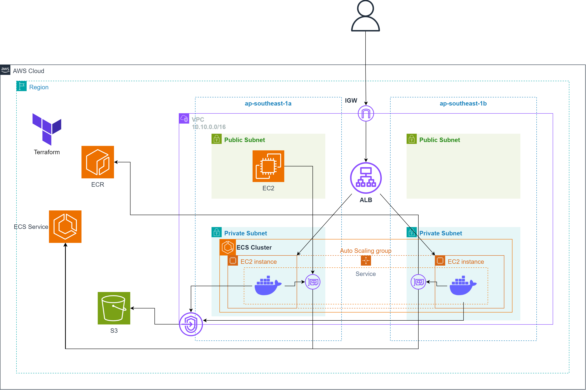

# Hosting Applications on ECS (EC2 Launch Type)

## Overview

This repo will guide you to build a custom Nginx application with Docker and run it on an ECS cluster EC2 Launch type according to the architecture below:

We will use **Terraform** to provision the infrastructure for this lab, including several AWS resources such as a VPC, ECS Cluster, EC2 instances, and an ECR repository.

After the infrastructure is successfully created, we will use SSM to access the EC2 instance, build a Docker image, and push it to the ECR repository. Then, we will create a service to run the container on ECS. 

## Project Structure

'''
├── modules/  
│   ├── Compute/               # Create compute resources like EC2 instances with an SSM role, enabling SSM access instead of SSH
│   ├── Container/             # Set up an ECR repository and ECS Cluster with EC2 launch type (EC2 instances in an Auto Scaling Group)
│   ├── Loadbalancing/         # Configure load balancing to route incoming traffic efficiently
│   └── Networking/            # Set up a VPC with public and private subnets, and configure VPC endpoints
├── scripts/  
│   └── userdata.sh            # A Bash script that runs on EC2 to install Docker and deploy a custom Nginx application
├── terraform/  
│   ├── data.tf                # Define data sources to fetch information about accounts and resources
│   ├── main.tf                # Call modules and provision cloud infrastructure resources
│   ├── outputs.tf             # Output block definitions, exposing key data after resource creation
│   ├── providers.tf           # Provider block configurations for managing the cloud infrastructure
│   ├── terraform.tf           # Defines the Terraform version and required providers for the configuration
'''

